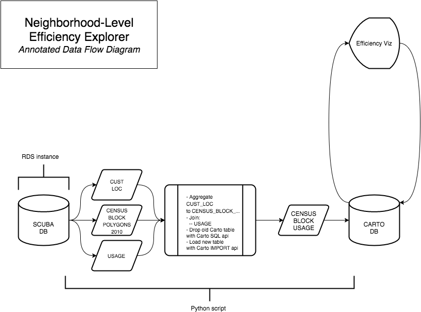

# CaDC Efficiency Explorer

The Governor's May 16 Executive Order (B-37-16) calls for the development of water use targets customized to the unique conditions of each urban water district as part of a new, permanent efficiency framework. The CaDC Efficiency Explorer is an interactive dashboard that provides insight and decision-support to policy makers involved in setting efficiency standards as well as to water managers managing within them.

This is an open project of the [California Data Collaborative](http://californiadatacollaborative.com/) coalition of water utilities and multidisciplinary partnerships powered by [ARGO Labs](http://www.argolabs.org/).

## In Action
The video [here](http://californiadatacollaborative.com/statewide-efficiency) demonstrates the Efficiency Explorer's functionality at an inter-water district level and at an intra-water district level.

## How do I get set up?
### Minimum Requirements
The minimum requirements to run an Efficiency Explorer are this repo and a [carto](carto.com) account to host geometry and attribute tables. See js/ss_config_example.js for required attribute table columns.

Once you have hosted your data on carto, copy "js/ss_config_example.js" to "js/ss_config.js" and update this new file with your specific configuration information (carto account name, table names, column names, etc.).

### Automating Data Updates
To keep data up-to-date, users will likely want to create an automated or semi-automated ETL pipeline. The ETL process we use with CaDC agencies is specific to our [SCUBA database](https://github.com/California-Data-Collaborative/scuba-schema), but the general concepts are all contained within the processing_file/update_etl.ipynb notebook. Below is a data flow diagram for our Neighborhood-Level Efficiency Explorer.

## Contributing and Additional Information
* To contribute to this project, please visit the efficiency-tool issues page
* For non-contribution related tool-specific questions, reach out to david@argolabs.org
* For more information about the CaDC (including joining), reach out to info@californiadatacollaborative.com
